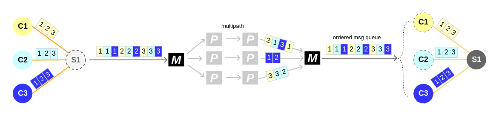

# es

Easy session/stream protocol

This is v2 of emsg (our private Easy Message Protocol)

OLD emsg and otunnel usage, ref to [Chinese usage of otunnel](http://ooclab.github.io/)

## Arch

### Message split design

simple message flow in one order

## Example

- [Simple Example](./example)
- [otunnel](https://github.com/ooclab/otunnel)
